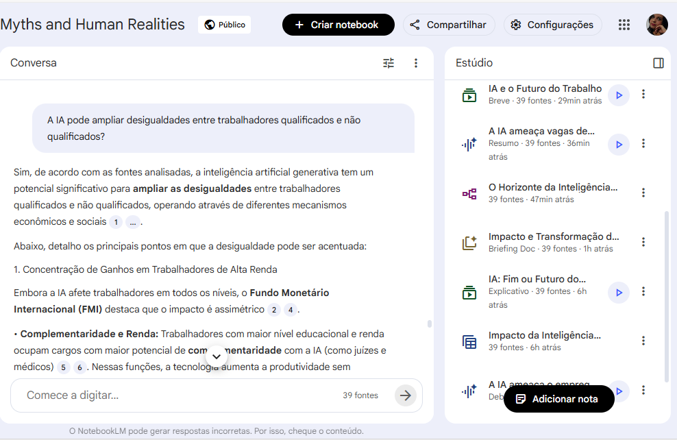
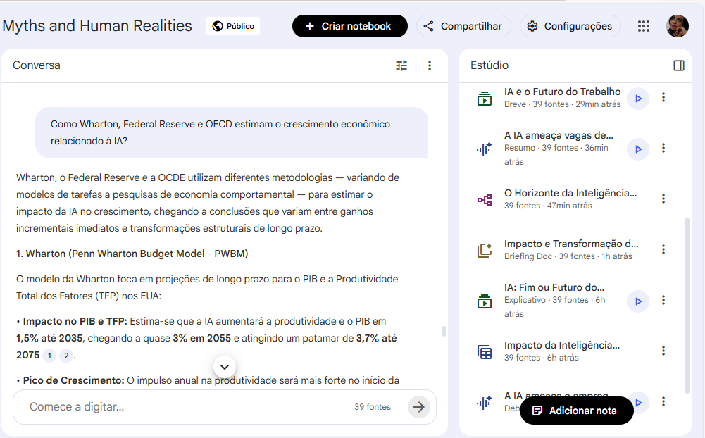

#  IA Generativa no Mercado de Trabalho: Medo, Mitos e Possibilidades Reais

##  Objetivo do Projeto

Este projeto tem como objetivo analisar o impacto da Inteligência Artificial generativa no mercado de trabalho global, com base em relatórios econômicos, estudos acadêmicos e análises de mercado publicadas por instituições como IMF, OECD, Goldman Sachs, ILO, Yale, Wharton e J.P. Morgan.

A proposta é compreender se a IA representa ameaça, transformação ou oportunidade para trabalhadores e empresas, distinguindo evidências reais de narrativas alarmistas.

---

## Como utilizei o NotebookLM

Utilizei o NotebookLM para:

- Organizar e sintetizar mais de 30 fontes entre relatórios, artigos e análises econômicas  
- Comparar projeções sobre substituição de empregos e aumento de produtividade  
- Identificar padrões recorrentes entre diferentes instituições  
- Analisar divergências entre discursos alarmistas e dados técnicos  
- Estruturar perguntas críticas sobre desigualdade, governança e novas competências  

A ferramenta foi essencial para consolidar informações complexas e extrair insights comparativos entre diferentes perspectivas.

---

##  Fontes Utilizadas

Foram utilizados relatórios e estudos de instituições internacionais, bancos globais, centros de pesquisa e análises de mercado, incluindo:

- International Monetary Fund (IMF)  
- Goldman Sachs  
- OECD  
- International Labour Organization (ILO)  
- Yale Budget Lab  
- Wharton Budget Model  
- Federal Reserve Bank of St. Louis  
- J.P. Morgan Global Research  
- Estudos acadêmicos recentes (2023–2026)  
- Pesquisas sobre uso de IA no meio acadêmico (HEPI, Frontiers)  
- Análises sobre Human-in-the-Loop e governança de IA  
- Estudos sobre novas profissões impulsionadas por IA  

*(Os links completos estão listados na documentação do projeto.)*

---

##  Processo de Análise

1. Inserção dos artigos e relatórios no NotebookLM  
2. Formulação de perguntas estratégicas sobre:
   - Substituição vs. transformação de empregos  
   - Impacto da IA na produtividade global  
   - Setores mais vulneráveis  
   - Novas funções emergentes  
   - Riscos de desigualdade  
   - Papel do Human-in-the-Loop  
3. Comparação entre projeções otimistas (ganhos de produtividade) e preocupações estruturais (desemprego, qualidade do trabalho)  
4. Consolidação dos principais consensos e divergências encontrados nas fontes  

---

##  Principais Resultados e Insights

- A IA generativa tende a transformar mais empregos do que eliminá-los completamente.  
- Países desenvolvidos podem ser mais impactados devido à maior exposição a funções cognitivas automatizáveis (IMF).  
- Há potencial significativo de aumento de produtividade global (Goldman Sachs, Wharton, OECD).  
- Existe risco de ampliação da desigualdade caso políticas públicas e qualificação profissional não acompanhem o avanço tecnológico.  
- Modelos com Human-in-the-Loop mostram melhores resultados em qualidade, controle e mitigação de riscos.  
- Novas funções estão surgindo, como engenheiros de prompt, especialistas em governança de IA e líderes estratégicos de automação.  
- O debate público frequentemente exagera tanto riscos quanto benefícios, sendo necessário separar hype de evidência empírica.  
- No ambiente acadêmico, a IA aumenta produção, mas pode impactar qualidade e pensamento crítico se usada sem supervisão.

---

##  Conclusão

A análise das fontes indica que a Inteligência Artificial não representa um colapso imediato do mercado de trabalho, mas sim uma transformação estrutural profunda.

O impacto real dependerá de:

- Capacitação e requalificação profissional  
- Políticas públicas adequadas  
- Governança responsável  
- Integração estratégica entre humanos e sistemas automatizados  

A IA surge como ferramenta de ampliação da produtividade, mas exige adaptação contínua e desenvolvimento de novas competências.

## 📸 Evidências do Uso do NotebookLM

  
 
 
 

## 📄 Arquivos Adicionais

Os documentos utilizados como base para análise estão disponíveis na pasta `/docs`:

### 🔹 Substituição ou Transformação de Empregos
- [IMF: Gen-AI - Artificial Intelligence and the Future of Work](docs/IMF_GenAI_FutureWork.pdf)
- [Goldman Sachs: How Will AI Affect the Global Workforce?](docs/GoldmanSachs_AI_Workforce.pdf)
- [Exploding Topics: 70+ Stats on AI Replacing Jobs](docs/ExplodingTopics_AI_Jobs_2026.pdf)

### 🔹 Impacto no Curto ou Longo Prazo / Crescimento Econômico
- [Federal Reserve: The Impact of Generative AI on Work Productivity](docs/FederalReserve_AI_Productivity.pdf)
- [Wharton: The Projected Impact of Generative AI on Future Productivity Growth](docs/Wharton_Growth_2025.pdf)
- [OECD: The Effects of Generative AI on Productivity, Innovation and Entrepreneurship](docs/OECD_AI_Productivity.pdf)

📄 A estratégia detalhada de prompts está disponível em [prompts.md](prompts.md)

